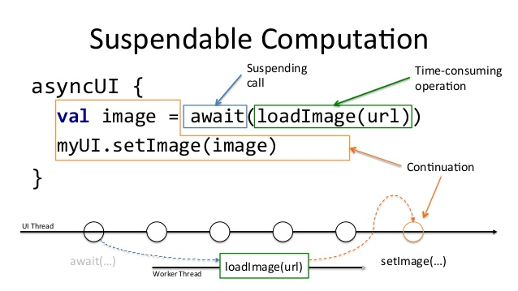

# Mobility Finder

**Mobility Finder** is a sample app which uses some of the latest _state-of-the-art_ features in the Android ecosystem

## Installation
Clone this repository and import into **Android Studio**

##### Clone with SSH
```bash
> git clone git@github.com:pablodeafsapps/mobility-finder.git
```

##### Clone with HTTPS
```bash
> git clone https://github.com/pablodeafsapps/mobility-finder.git
```

## Architecture and project organization
To address this sample app development, a class hierarchy based on the
[**Clean Architecture**](https://blog.cleancoder.com/uncle-bob/2012/08/13/the-clean-architecture.html)
paradigm is used (credits to Robert C. Martin - Uncle Bob).


### Class hierarchy
Among the different implementations for Android applications of the
aforementioned paradigm, there are remarkable contributions such as the
ones from
[Antonio Leiva](https://antonioleiva.com/clean-architecture-android/)
and
[Fernando Cejas](https://fernandocejas.com/2014/09/03/architecting-android-the-clean-way/).
Precisely, this latter work has served as the main inspiration for this
application architecture.


Therefore, the prior idea in this project is concern-layers separation.
Each of this entities is in charge of certain responsibilities, which
are handled in isolation. These layers get interconnected thanks to
interfaces, which allow to achieve the necessary abstraction between
them.

* **Presentation** This layer's duties consist of managing the events
caused by the user interactions, and rendering the information coming
from the _domain_ layer. In this particular case, a Model-View-ViewModel
([MVVM](https://proandroiddev.com/mvvm-architecture-viewmodel-and-livedata-part-1-604f50cda1))
architecture pattern has been selected. This entity "sees" the _domain_
layer.

* **Domain** This layer is in charge of the application business logic.
  It is built upon _use-cases_ and repositories _repository pattern_).
  The _domain_ layer obtains data from the _data_ module and use them to
  perform all the required operations. It also is in charge of
  formatting the outcomes to later deliver them to the _presentation_
  layer. This entity only contains Kotlin code, and thus testing should
  only consist of **Unit Tests**. This layer represents the most inner
  entity, and thus it does not "see" anyone but itself.

* **Data** This layer simply contains libraries and frameworks which
  provide data to the application (data sources). Among them, stands out
  service-query frameworks (_Retrofit_), local databases (_Room_),
  events tracking (_Omniture_), etc. This layer "sees" the _domain_
  layer.

The usage of this class hierarchy and package organization pursues
grasping **SOLID** principles, enhancing versatility and easing code
testing.

### Inversion of Control
In order to facilitate the interaction between the above described
layers, _Mobility Finder_ uses a dependency injection scheme.
**[Dagger](https://www.raywenderlich.com/262-dependency-injection-in-android-with-dagger-2-and-kotlin)**
is a framework which allows to abstract type injection in a neat and
clear manner.

This is a multi-module Android project, and thus _Dagger_ makes use of
_Subcomponents_.

### Coroutines
Since _multithreading_ has historically been a challenge in Android
Development,
[coroutines](https://codelabs.developers.google.com/codelabs/kotlin-coroutines/#0)
have been included. This is one of the most interesting and appealing
features recently introduced in Kotlin.



Using _coroutines_ facilitates and enhances multithreading management.
_Coroutines_ allow to turn asynchronous operations into synchronous
code, without affecting the application overall performance.

From the _execution-flow_ perspective, every task is undertaken in the
main thread (UI thread), until a _use-case_ is invoked. From that moment
onwards, operations are handled in worker threads, to later retrieve the
computed results in the main thread again.

## Maintainers
This project is mantained by:
* [Pablo L. Sordo Martínez](http://github.com/pablodeafsapps)

## Issues
If you happen to find any issue or suggestion, feel free to start a new
thread on the _Issues_ section of the repository. I will try to address
it as soon as possible.

## Contributing
1. Fork it
2. Create your feature branch (git checkout -b my-new-feature)
3. Commit your changes (git commit -m 'Add some feature')
4. Push your branch (git push origin my-new-feature)
5. Create a new Pull Request